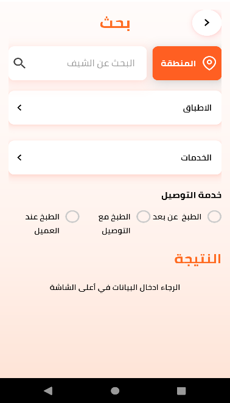

<h1 align="center">
  <br/>
  </a>
  <h4 align="center">A front-end mobile application for traditional meal delivery built with <a href="https://reactnative.dev/" target="_blank">React Native</a>.</h4>
  <br/>
</h1>
<div align="center">


[](https://opensource.org/licenses/MIT)
</div>

<p align="center">
  <a href="#basic-overview">Basic overview</a> •
  <a href="#key-features">Key features</a> •
  <a href="#technology-used">Technology used</a> •
  <a href="#how-to-use">How to use</a> •
  <a href="#project-overview">Project overview</a> •
  <a href="#you-may-also-like">You may also like</a>
  
</p>

## Basic overview
Tahi is a cross-platform mobile application built with React native for traditional food delivery, that aims to reduce contact during the COVID-19 period.  


## Key features
* One Time Password (OTP) authentification.
* Advanced plates search/filter functionality.
* Food rating (5 stars rating with comment)
* Implemented call to action buttons (calls and messages)

## Technology used

<p align="left">
  
      

</p>


## How to use
To clone and run this application, you'll need [Git](https://git-scm.com) and [Node.js](https://nodejs.org/en/download/) (which comes with [npm](http://npmjs.com)) installed on your computer and [Setting the development environment](https://reactnative.dev/docs/environment-setup).
From your command line:
```bash
# Clone this repository
$ git clone https://github.com/Hassene66/Tahi-Project

# Go into the repository
$ cd Tahi-Project

# Install dependencies
$ npm install

# Run the app on Android simulator
$ npm run android
or
# Run the app on IOS simulator (for mac users only)
$ npm run ios
```


## Project  overview


| | | | |
|:-------------------------:|:-------------------------:|:-------------------------:|:-------------------------:|
| ||  |  |
|  |  |||
|||


## You may also like

- [HiCoach](https://github.com/salimkazdaghli/Hicotech-Frontend) - A coaching web app.
- [ISAMM Labs](https://github.com/Hassene66/IsammLabs) - A laboratories managment system mobile app.